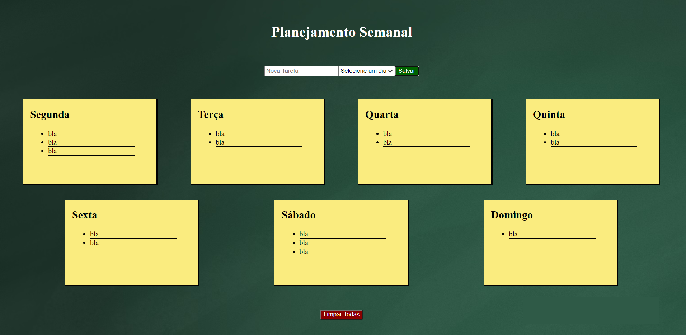

# AstroPlanner

## Stack
* React.js
* Redux
* Axios
* Materia-UI
* Styled-components
* Jest
* Enzyme

## Language
The app is originally designed for Portuguese speakers. 
Nonetheless, it's fairly intuitive and can be translated to English by Google Chrome, for instance.
Notice, however, that "Wednesday" and "Thursday" will be wrongly translated as "Fourth" and "Fifth"

## Running the project 
* Clone this repository into your machine
* Open your terminal inside the cloned repo and run `npm install` and `npm run start`

## API
This project is originally a demo integrated with Labenu's API: 

  https://us-central1-missao-newton.cloudfunctions.net/generic/planner-mateus
  
Therefore, in order to run the tests regarding Axios, 
you need to comment the functions **create** and **fetchTasks** at `src/actions/index.js`
and uncomment their respective counterparts.
Notice that the "Clear All" button has no use in this version of the app.
